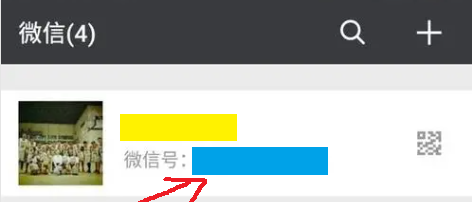
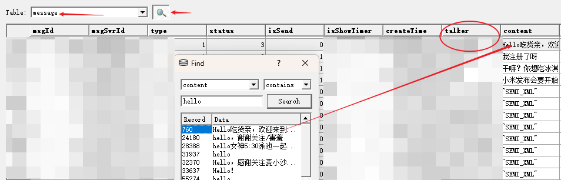

## 说明

此目录是从数据库导出并解密下一步需要的 JSON 。 <br />
除若干字段使用 wechat 源码里面的方法解码外基本无处理 <br />

### 使用

0.  🎞️ 安装 node 环境 [http://lqzhgood.github.io/Shmily/guide/setup-runtime/nodejs.html]

```diff
+ 🎞️ 1-5   -->   https://www.bilibili.com/video/BV1Tc411q7Kw/
```

1.  从 [1 decode db](https://github.com/lqzhgood/Shmily-Get-Wechat/tree/main/export/db-android/1%20decode%20db) 导出 `decrypted_database.db` 复制到 `input` 下
2.  获取 `微信ID`
    <details>

    1. 通过微信查看对方 `微信ID`<br />
       
    2. 通过数据库查看<br />
       `export\db-android\1 decode db\ViewDB\wxsqlcipher\wxsqlcipher.exe` 打开数据库 `decrypted_database.db`<br />
       按图搜索消息内容找到对应的 `talker`<br />
       

    </details>

3.  修改 `config.js`
4.  执行 `npm run build`
5.  复制 `dist`内容到 `/ToMsg/input/JSON/db-android` 目录中

### 说明

#### `.\lib\decodeMessageTable`

此目录为导出 `message` 并解密某些字段的核心代码, 通过 `java` 实现, 已编译为 `exe` 封装在程序中. Mac 等其他平台需从源码执行.

输出目录如下

```
-\ dist
    - BLOB
        - ${msgId}-lvbuffer
    - message.json 解密的消息
    - emoji_key.txt 解密表情需要用到的 key
    - xxxx.json 用到的数据库其他表

// 关于 BLOB 文件夹
内容是 `lvbuffer` 字段的二进制数据, 通过 Utf-8 编码写入文本. 应该需要从 buffer 16 进制去分析解码
应该按照不同消息类型有不一样的解码方式

-  已知下列情况会用到
    -   语音通话, utf-8 解码出描述文字(通话 xx 秒)
```

### FAQ

-   报错 `Java heap space` --> [issues #2](https://github.com/lqzhgood/Shmily-Get-Wechat/issues/2)
